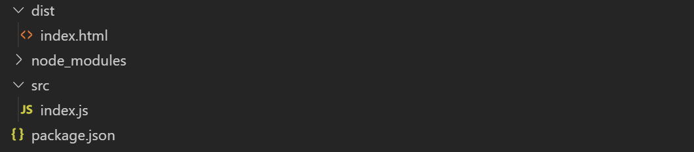
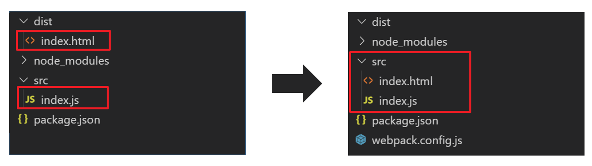

##  一、安装和使用Webpack

#### 1. 初始化项目

```shell
mkdir jianshu-react 
cd jianshu-react
npm init -y
```

##### 2.安装Webpack

```shell
npm install -D webpack webpack-cli
```

`npm i -D `是 `npm install --save-dev` 的简写，是指安装模块并保存到 package.json 的 devDependencies中，主要在开发环境中的依赖包。

##### 3. 新建文件，初始化项目目录 

在根目录下新建 **src** 文件夹，在 **src** 文件夹下，新建index.js文件，文件中书写以下代码：

```js
document.querySelector('#root').innerHTML = 'Hello jainshu-react';
```

在根目录下新建 **dist** 目录，在 **dist** 目录下，新建index.html文件，文件中书写以下代码：

```html
<!DOCTYPE html>
<html lang="en">
<head>
    <meta charset="UTF-8">
    <title>Title</title>
</head>
<body>
<div id="root"></div>
<script src="bundle.js"></script>
</body>
</html>
```

最终的代码结构如下：



## 二、配置Webpack和构建本地开发服务器

在根目录下创建 **webpack.config.js** 配置文件，在里面书写以下配置代码：

```js
const path=require('path');
module.exports={
    entry:'./src/index.js',
    output:{
        filename:'bundle.js',
        path:path.resolve(__dirname,'dist')
    }
};
```

在 **package.json** 文件中添加一条script脚本命令:

```js
"scripts": {
    "test": "echo \"Error: no test specified\" && exit 1",
    "build": "webpack --mode production"	// 新增的脚本命令
},
```

现在我们就可以运行`npm run build`来对项目进行打包编译了。

为了我们开发的便捷，一般情况下我们都是需要借助Webpack来构建一个本地开发服务器，方便实时调试代码。构建本地开发服务器，首先使用以下命令安装webpack-dev-server ：

```shell
npm i -D webpack-dev-server
```

安装完成之后，修改**webpack.config.js**中的配置：

```js
const path = require('path');
module.exports = {
    entry: './src/index.js',
    output: {
        filename: 'bundle.js',
        path: path.resolve(__dirname, 'dist')
    },
    /*----以下是新增的配置代码----*/
    devServer: {
        contentBase: "./dist",      // 本地服务器所加载的页面所在的目录
        historyApiFallback: true,   // 不跳转
        inline: true,               // 实时刷新
        port: 3000,                 // 项目所使用的端口
        open: true,                 // 自动打开浏览器
    }
};
```

在 **package.json** 文件中添加一条script脚本命令，用来进行开启本地开发服务器：

```js
"scripts": {
    "test": "echo \"Error: no test specified\" && exit 1",
    "build": "webpack --mode production",
    "start": "webpack-dev-server --mode development"	// 新增的命令
},
```

现在我们就可以运行`npm run start`，就可以通过 **localhost:3000/** 来访问我们的项目了。

## 三、配置HTML模板 

配置HTML模板之前，首先改变一下我们之前的代码目录结构，具体的操作就是将 **/dist/index.html** 文件，移动到 **src** 目录下，如下图所示：



然后执行以下命令，安装html-webpack-plugin 插件：

```shell
npm i html-webpack-plugin -D
```

安装完成之后，修改 **webpack.config.js**文件中的配置：

```js
const path = require('path');
let webpack=require('webpack');
let HtmlWebpackPlugin=require('html-webpack-plugin');	// 引入插件
module.exports = {
    entry: './src/index.js',
    output: {
        //添加hash可以防止文件缓存,每次都会生成4位hash串
        filename: 'bundle.[hash:4].js',
        path: path.resolve('dist')
    },
    devServer: {
        contentBase: "./dist",
        historyApiFallback: true,
        inline: true,
        port: 3000,
        open: true,
    },
    /*----以下是新增的配置代码----*/
    plugins: [
        new HtmlWebpackPlugin({
            template: './src/index.html',
            hash: true,         //会在打包好的bundle.js后面加上hash串
        })
    ]
};
```

关于HTML模板的详情，大家可以参考之前的一篇博客：[webpack入门学习笔记04 —— 安装和配置webpack开发服务器](https://juejin.im/post/5d0cdade6fb9a07ee0631f9a )。

配置完成之后，就可以执行 `npm run build`进行打包编译了，打包后会在 **dist** 目录下生成 html文件和js文件。但是现在每次进行打包编译，**dist** 目录之前生成的文件不会被删除。这些文件留着又没有什么用处，所以可以进行以下配置，每次打包编译之前，首先将**dist** 目录下的文件给删除，然后再生成新的文件。

执行以下命令安装clean-webpack-plugin 插件：

```shell
npm i clean-webpack-plugin -D
```

安装完成之后，修改 **webpack.config.js**文件中的配置：

```js
const path = require('path');
let webpack = require('webpack');
let HtmlWebpackPlugin = require('html-webpack-plugin');
let { CleanWebpackPlugin } = require('clean-webpack-plugin');	// 引入插件
module.exports = {
    /* 其他配置和上面一样 */
    plugins: [
        new HtmlWebpackPlugin({
            template: './src/index.html',
            hash: true, 
        }),
        new CleanWebpackPlugin() //打包前先清空
    ]
};
```

## 四、配置Babel，编译ES语法和JSX语法

这是很重要的一个环节，也是很容易出错的一个环节，可能会出现你按照网上的一些教程进行配置，结果还是会报错的情况。这是因为Babel版本的问题。

现在Babel版本是7.x，安装和配置方式和之前的版本有所不一样。所以如果你配置完成之后，编译项目还是会出错，可以百度相关错误，或者到[Babel官网](https://www.babeljs.cn/ )查看相应的安装和配置方式。

执行以下命令，安装所需要的插件和工具：

```shell
npm i @babel/core babel-loader @babel/preset-env @babel/preset-react --save-dev
```

安装完成之后，在项目根目录下新建 **.babelrc** 配置文件（注意文件名之前需要带有点），配置代码如下：

```js
{
    "presets": ["@babel/preset-env", "@babel/preset-react"]
}
```

然后修改 **webpack.config.js**文件中的配置：

```js
/* 其他配置和上面一样 */
module.exports = {
    module:{
        rules:[
            {
                test:/\.(jsx|js)$/,
                exclude:/(node_modules)/,  //排除掉nod_modules,优化打包速度
                use:{
                    loader:'babel-loader'
                }
            }
        ]
    }
};
```

## 五、配置React，编写 React 组件

想要使用React语法编写组件，首先要安装React，安装命令如下：

```shell
npm i react react-dom -S
```

安装完成之后，我们就可以开开心心地编写React代码了。现在 **src** 目录下新建一个 **App.jsx** 文件，在里面书写以下代码：

```jsx
import React from 'react';
class App extends React.Component{
    render(){
        return (
            <div>Hello, jianshu - react</div>
        );
    }
}
export default App;
```

然后修改 **src/index.js** 文件中的代码，代码如下：

```jsx
import React from 'react';
import ReactDOM from 'react-dom';
import App from './App.jsx';
ReactDOM.render(
    <App/>,
    document.getElementById('root')
);
```

现在执行 `npm run start` 就可以通过 **localhost:3000/** 访问我们编写的React项目了，也就是说从现在开始，我们就可以正常地编写React代码了。

## 六、配置SASS处理规则

我们准备在项目中使用SASS这一CSS预处理器，所以还需要配置SASS的处理规则。首先使用以下命令安装所需要的工具：

```shell
npm install style-loader css-loader url-loader --save-dev
npm install sass-loader node-sass --save-dev
npm install --save-dev mini-css-extract-plugin 
```

全部安装完成之后，进行修改 **webpack.config.js**文件中的配置：

```js
/* 其他配置和上面一样 */
let MiniCssExtractPlugin=require("mini-css-extract-plugin");
module.exports = {
    plugins: [
        /* 提取单独打包css文件 */
        new MiniCssExtractPlugin({
            filename: "[name].css",
            chunkFilename: "[id].css"
        })
    ],
    module:{
        rules:[
            {
                test:/\.(png|jpg|gif)$/,
                use:[
                    "url-loader"
                ]
            },
            {
                test:/\.(scss|css)$/,
                use:[
                    "style-loader",
                    "css-loader",
                    "sass-loader"
                ]
            }
        ]
    }
};
```

## 七、写在最后

到这里，我们就完成了React的初始化工作，下面就可以开始我们的React简书项目之旅了。

最后还是要提醒一点，如果大家按照上面的步骤一步一步操作，结果在编译项目的时候，控制台报出了一些错误，这可能是因为第三方包版本升级导致，大家可以自行百度一下相关错误信息，相信一定可以找到解决方案。
