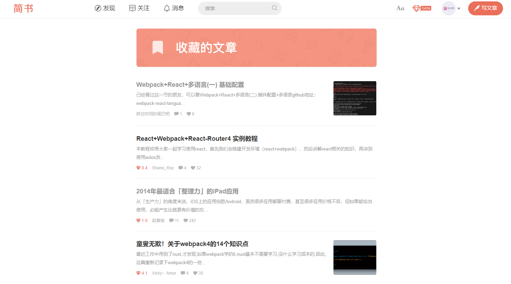
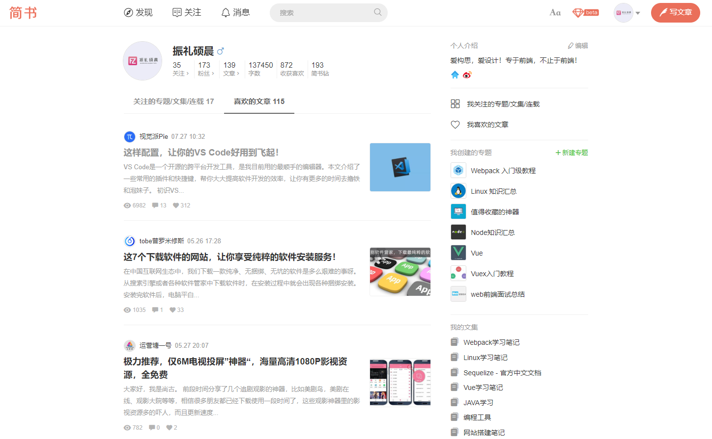
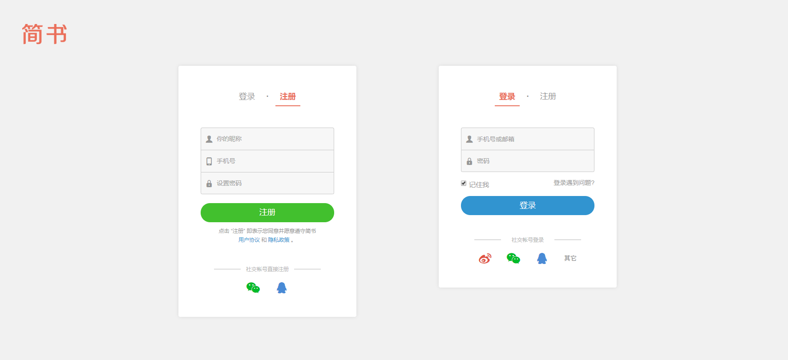

## 1. 写在前面

这个Github仓库是对自己使用React模仿简书项目的总结，React模仿简书项目的Github地址是：[Jianshu-React](https://github.com/Fengzhen8023/Jianshu-React )。

在初始化React项目的时候，我们可以选择 [React官方文档](https://react.docschina.org/docs/create-a-new-react-app.html ) 给出的方法，即使用类似以下命令进行初始化一个 React 项目：

```shell
npx create-react-app my-app
cd my-app
npm start
```

但是我还是非常建议大家使用Webpack一步步来搭建我们的项目，这样一来可以熟悉整个项目的代码结构，以及对Webpack有一个清晰的认识。

本系列博客的初衷是带着大家使用React模仿简书官网，所以不会有大量笔墨介绍Webpack的使用，如果大家有需要学习Webpack，可以通过以下两个链接查看博主之前写的文档，相信对小白来说会是一个很好的入门选择：

- [Githun 仓库：webpack-learning](https://github.com/Fengzhen8023/webpack-learning )
- [掘金博客 - 振礼硕晨](https://juejin.im/post/5d02562b6fb9a07ec27b9eea )

下面正式开始本系列博客：使用Webpack初始化一个React项目，该项目是模仿简书官网，包括简书的注册、登录、浏览文章、收藏、点赞等功能，最终的效果图大致如下：








## 2. 项目简介

初始化项目之初，我准备使用React + SASS来书写页面，后期会引入Redux来组织数据，使用路由来组织页面逻辑等等。所以在初始化项目的时候，主要介绍如何配置Webpack，来对React语法和SASS语法进行处理。

需要特别注意的是，现在是2019年8月份，Node.js的最新版本是12，我在做开发时候使用的Node.js版本也是12。

随着Node.js、Webpack以及第三方包的更新升级，可能会有一些第三方包（比如babel）安装和使用有所变化，所以如果大家在看这篇博客初始化项目的时候，发现有报错，需要自行百度，进行解决相关问题。

## 3. 博客目录

**[1. 使用Webpack初始化一个React项目.md](https://github.com/Fengzhen8023/Jianshu-React-Blog/blob/master/1. 使用Webpack初始化一个React项目.md)**


